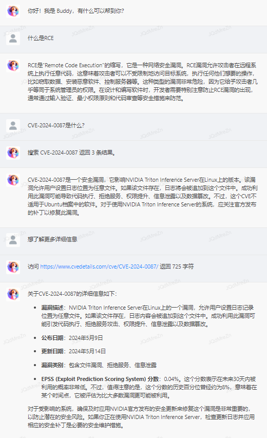

# Tenbot: A Chatbot for Exploring Large Language Model Capabilities

## Directory Explanation

- **web**: A simple chat interface supporting code highlighting, Latex formula rendering, and on-demand tool invocation.
- **tools**: Provides backend functionalities including Tokenization, content search, URL visiting, logging, etc.
- **api**: Access point for multiple LLM nodes, offering an OpenAI Compatible API with simple load balancing and facilitating tests across different models.

## Screenshot

## TODO List

- Automatically optimize the length of dialog content
- Integrate VL series multimodal models to accept image inputs from users
- Enable reading of document formats such as PDF, DOCX, XLSX, TXT, and more.
