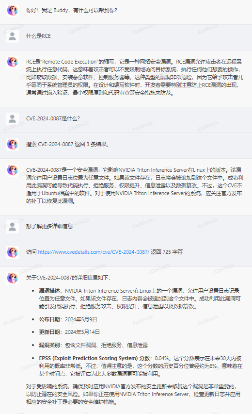

# Tenbot 一个用于大语言模型能力探索的聊天机器人

## 目录说明

- web: 一个简单的聊天界面，支持代码高亮、Latex 公式渲染，支持按需调用工具
- tools: 提供 Tokenize、内容搜索、访问 URL、日志等后端功能
- api: 多个 LLM 节点接入，提供 OpenAI Compatible API，实现了简单的负载均衡调度，也方便测试不同模型

## 测试截图

## TODO

- 自动优化对话内容长度
- VL 系列多模态模型，允许用户输入图片
- PDF、DOCX、XLSX、TXT 等文档文件的阅读
